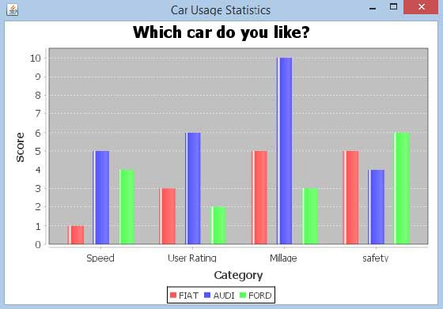

## Main parts
1. For mainly rendering issue, the better way to display the data with full set of x,y data is xyLineChart.
2. I've create a function in 
file LineChart.java called "createModifiedChart" to create a new lineChart and fit in the method
3. I've create a function in 
class "createData" called "xySeriesDataSet" to fit the function "createModifiedChart" to create new Linechart.
4. The origin one CategoryPlot will cause the plot draw a new grid for each data set, where the issue occurs.
	CategoryPlot is much fit to draw the circumstance like comparing differece values set by set.
	For example, if you want to display the three kind of product selling amount in different index.
	
	
## More grid line
The library "jFreeChart" didn't support a strong function for the gridline controls.
So we shoud try to make gridline be more simplify as much in XYLineChart.
And use another class called ValueMarker to draw the custom gridlines we want.
## Details part
1. The font system seems not working properly, mayby there's some language package issue.
2. Align some parts of comment and code to make it more readable.
3. Change the class name "createDataa" to "createData"
4. Change the path to "relative" instead of "absolute path".
